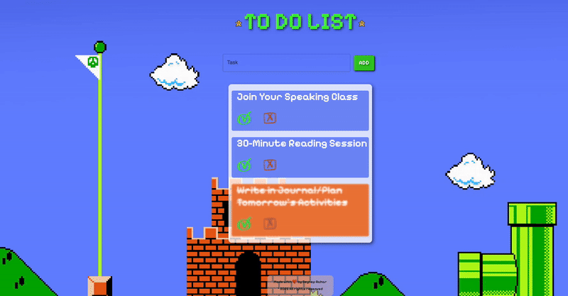

# To-Do App 🕰️

Welcome to the **To-Do App**, a simple and intuitive task management application built with modern web technologies. This app helps you organize your tasks efficiently and stay on top of your daily activities.

👉 **Live Demo:** [https://masters-to-do-app.netlify.app/](https://masters-to-do-app.netlify.app/)

---

## Features

- **Add Tasks:** Easily add new tasks with a title and description.
- **Mark as Completed:** Check off tasks when they are completed.
- **Delete Tasks:** Remove tasks you no longer need.
- **Responsive Design:** Works seamlessly on desktop, tablet, and mobile devices.
- **Persistent Data:** Tasks are saved in your browser's local storage, so they persist even after refreshing the page.

---

## Technologies Used

- **Frontend:**

  - React.js (for building the user interface)
  - Redux (for state management)
  - Material UI (for pre-built, customizable UI components)
  - Bootstrap (for responsive design and layout)
  - CSS (for styling)
- **Deployment:**

  - Netlify (for hosting the application)
- **Version Control:**

  - Git & GitHub (for code management and collaboration)

---

## How to Use

1. **Add a Task:**

   - Enter the task title and description in the input fields.
   - Click the "Add" button to add the task to your list.

2. **Mark a Task as Completed:**

   - Click the checkbox next to a task to mark it as completed.

3. **Delete a Task:**
   - Click the trash icon next to a task to remove it from your list.

---

## Demo



---

## Project Structure

```plaintext
📦src
 ┣ 📂assets
 ┃ ┣ 📜bg.png
 ┃ ┣ 📜cross.png
 ┃ ┣ 📜done.png
 ┃ ┣ 📜star1.svg
 ┃ ┗ 📜star2.svg
 ┣ 📂components
 ┃ ┣ 📜TodoInput.jsx
 ┃ ┣ 📜TodoItem.jsx
 ┃ ┗ 📜TodoList.jsx
 ┣ 📂pages
 ┃ ┣ 📂Footer
 ┃ ┃ ┣ 📜Footer.css
 ┃ ┃ ┗ 📜Footer.jsx
 ┃ ┣ 📂Header
 ┃ ┃ ┣ 📜Header.css
 ┃ ┃ ┗ 📜Header.jsx
 ┃ ┗ 📂MainPage
 ┃ ┃ ┣ 📜Todo.css
 ┃ ┃ ┗ 📜Todo.jsx
 ┣ 📂redux
 ┃ ┣ 📂actions
 ┃ ┃ ┗ 📜todoActions.jsx
 ┃ ┣ 📂reducers
 ┃ ┃ ┗ 📜todoReducer.jsx
 ┃ ┗ 📜store.jsx
 ┣ 📜App.css
 ┣ 📜App.jsx
 ┗ 📜index.jsx
 ```

## Installation

If you'd like to run this project locally, follow these steps:

1. **Clone the Repository:**

   ```bash
    git clone https://github.com/zbaharyilmaz/To-Do-App.git
2. **Navigate to the Project Directory:**

   ```bash
    cd To-Do-App
3. **Install Dependencies:**

   ```bash
    pnpm install
4. **Run the Development Server:**

   ```bash
    pnpm dev
5. **Open the App:**

- Visit http://localhost:3000 in your browser to view the app.

---

## Contributing

- Contributions are welcome! If you'd like to contribute to this project, please follow these steps:

- Fork the repository.

- Create a new branch for your feature or bugfix.

- Commit your changes.

- Push your branch and open a pull request.

---

## License

- This project is licensed under the MIT License. See the LICENSE file for details.

---

## Acknowledgements

- Thanks to Netlify for providing free hosting for this project.

- Special thanks to the React.js community for their amazing resources and support.
